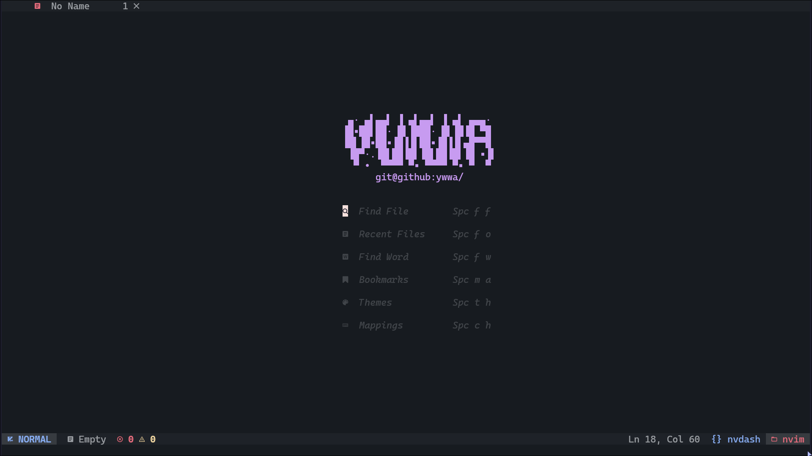
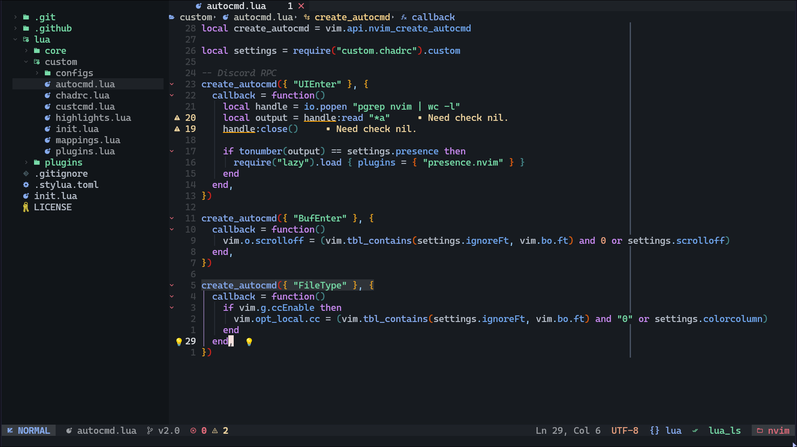
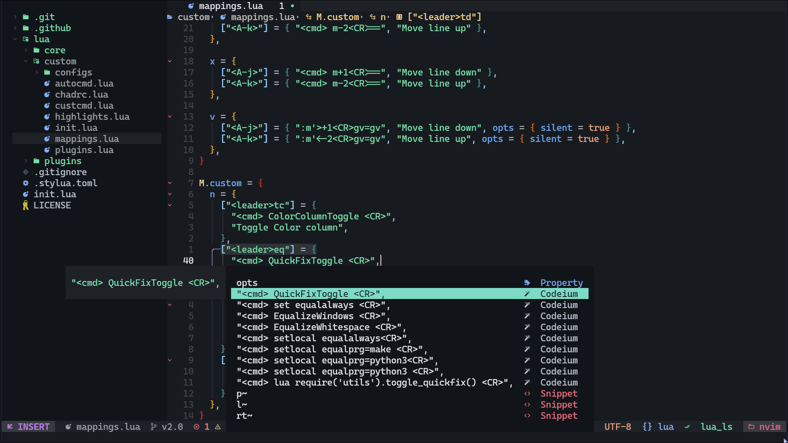

<div align="center">

```lua
" ▄· ▄▌▄▄▌ ▐ ▄▌▄▄▌ ▐ ▄▌ ▄▄▄· ",
"▐█▪██▌██· █▌▐███· █▌▐█▐█ ▀█ ",
"▐█▌▐█▪██▪▐█▐▐▌██▪▐█▐▐▌▄█▀▀█ ",
" ▐█▀·.▐█▌██▐█▌▐█▌██▐█▌▐█ ▪▐▌",
"  ▀ •  ▀▀▀▀ ▀▪ ▀▀▀▀ ▀▪ ▀  ▀ ",
"      git@github:ywwa/      ",
```

Pretty Lazy
<a href="https://github.com/NvChad/NvChad">NvChad</a>
config
<a href="https://ywwa.github.io">V3.0</a>!

</div>

##### Description
This repository contains my neovim configuration that i use as my daily driver.

It's made mainly for WEB development using `typescript` language.

#### Presecuites
|    ***    |    ***      |
|---------- | ----------- |
| Neovim    | V0.9,2+     |
| OS        | Linux       |
| Terminal  | Alacritty   |
| Font      | Nerd Fonts  |

If you are planning to use my configuration, then you might have to make some changes to get it to work properly.

#### Preview




#### Help
In case you need any help with my configuration feel free to open new issue or contact me in official NvChad's <a href="https://discord.com/invite/gADmkJb9Fb">Discord Server</a> or <a href="https://t.me/nvchad_tg">Telegram channel</a>
