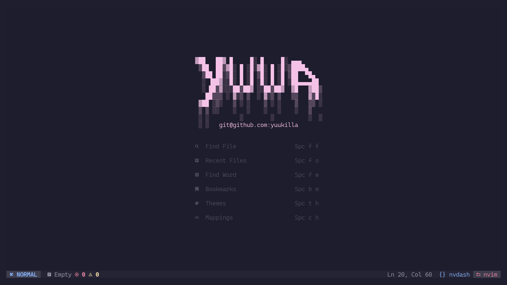
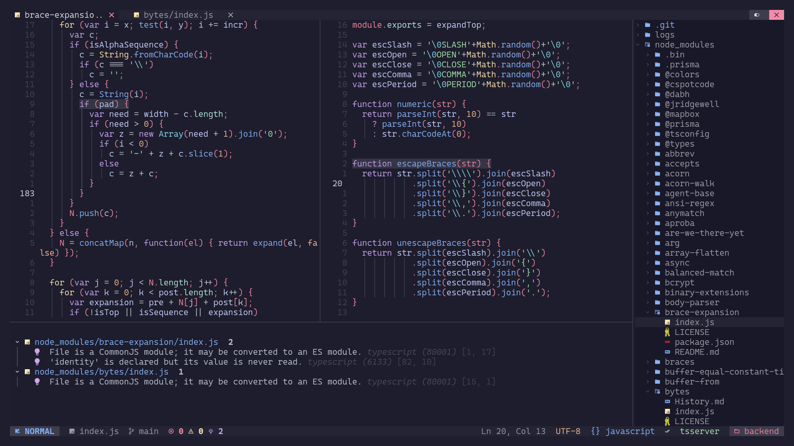

<h1 align="center">Nvim(Chad) configuration</h1>

<h3 align="center">
    



</h3>
<hr>

### plugins.lua
```lua
{
   1 "aserowy/tmux.nvim",                   -- Navigation between tmux and neovim
   2 "rest-nvim/rest.nvim",                 -- Run HTTP Requests inside neovim
   3 "folke/noice.nvim",                    -- Noice.
   4 "toppair/peek.nvim",                   -- Live markdown preview
   5 "andreadev-it/shade.nvim",             -- Darken unfocused buffers
   6 "folke/trouble.nvim",                  -- Make debugging more comfortable
   7 "folke/zen-mode.nvim",                 -- Zen mode
   8 "karb94/neoscroll.nvim",               -- Smooooooth
   9 "andweeb/presence.nvim",               -- Avarage discord user
  10 "elkowar/yuck.vim",                    -- Eww configuration yuck language support
  11 "lukas-reineke/virt-column.nvim",      -- Better colorcolumn (wont make eyes bleed)
  12 "f-person/git-blame.nvim",             -- Git Blame
  13 "Aasim-A/scrollEOF.nvim",              -- Better scrolloff what goes past EOF
}
```

#### Important Note 
"`tmux.nvim`" requires additional configuration of `tmux.conf` file

```lua
is_vim="ps -o state= -o comm= -t '#{pane_tty}' | grep -iqE '^[^TXZ ]+ +(\\S+\\/)?g?(view|n?vim?x?)(diff)?$'"

bind-key -n 'C-h' if-shell "$is_vim" 'send-keys C-h' { if -F '#{pane_at_left}' '' 'select-pane -L' }
bind-key -n 'C-j' if-shell "$is_vim" 'send-keys C-j' { if -F '#{pane_at_bottom}' '' 'select-pane -D' }
bind-key -n 'C-k' if-shell "$is_vim" 'send-keys C-k' { if -F '#{pane_at_top}' '' 'select-pane -U' }
bind-key -n 'C-l' if-shell "$is_vim" 'send-keys C-l' { if -F '#{pane_at_right}' '' 'select-pane -R' }

bind-key -T copy-mode-vi 'C-h' if -F '#{pane_at_left}' '' 'select-pane -L'
bind-key -T copy-mode-vi 'C-j' if -F '#{pane_at_bottom}' '' 'select-pane -D'
bind-key -T copy-mode-vi 'C-k' if -F '#{pane_at_top}' '' 'select-pane -U'
bind-key -T copy-mode-vi 'C-l' if -F '#{pane_at_right}' '' 'select-pane -R'
```

More information can be found here [aserowy/tmux.nvim](https://github.com/aserowy/tmux.nvim#navigation)

### mappings.lua
```lua
  "SPC c c"     -- Toggle colorcolumn display
  "SPC g b"     -- Toggle gitblame displayer

  "CTRL  R"     -- Run HTTP Request (RestRun)
  "CTRL  T"     -- Open Markdown preview (PeekOpen)
  "CTRL  Y"     -- CLose Markdown preview (PeekClose)

  "LEFT   "     -- Disabled
  "Down   "     -- Disabled
  "Up     "     -- Disabled
  "Right  "     -- Disabled
```
**Default behaviour of `<C-[h,j,k,l]>` is disabled and handled by `tmux.nvim` plugin**

### commands.lua

```lua
-- Auto Command for removing scrolloff for certain filetypes
create_autocmd({ "BufEnter" }, {
  callback = function ()
    vim.o.scrolloff = (
      vim.bo.filetype == "NvimTree" or
      vim.bo.filetype == "nvdash"   or
      vim.bo.filetype == "terminal")
      and 0 or 10
  end
})
```
